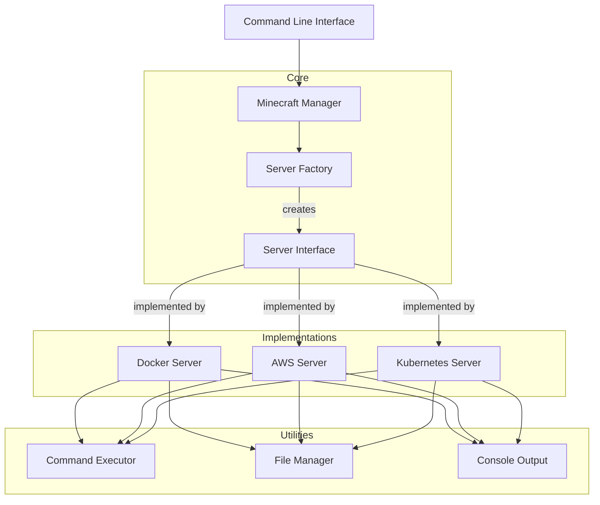
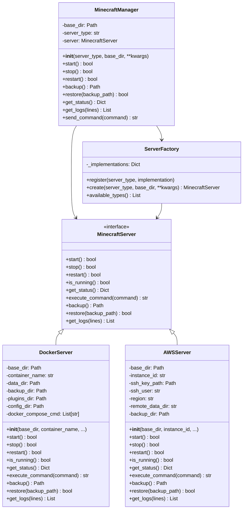
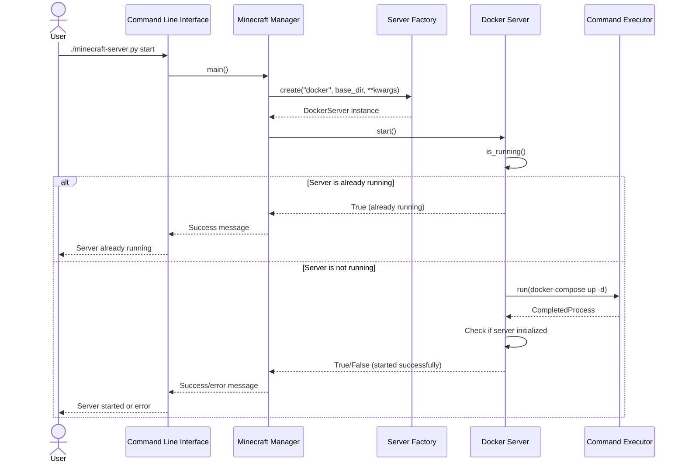
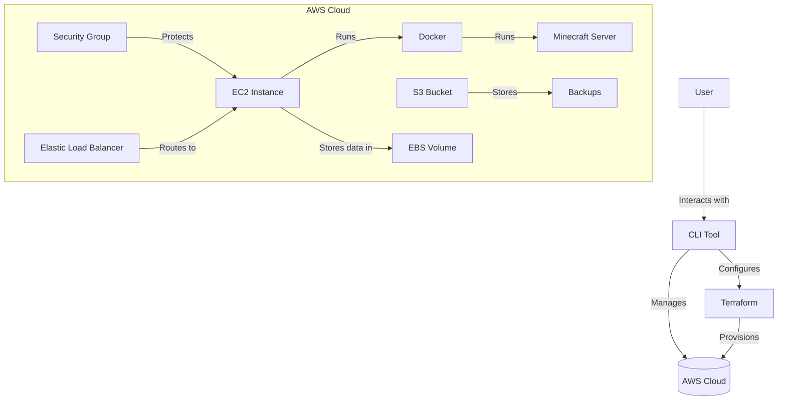
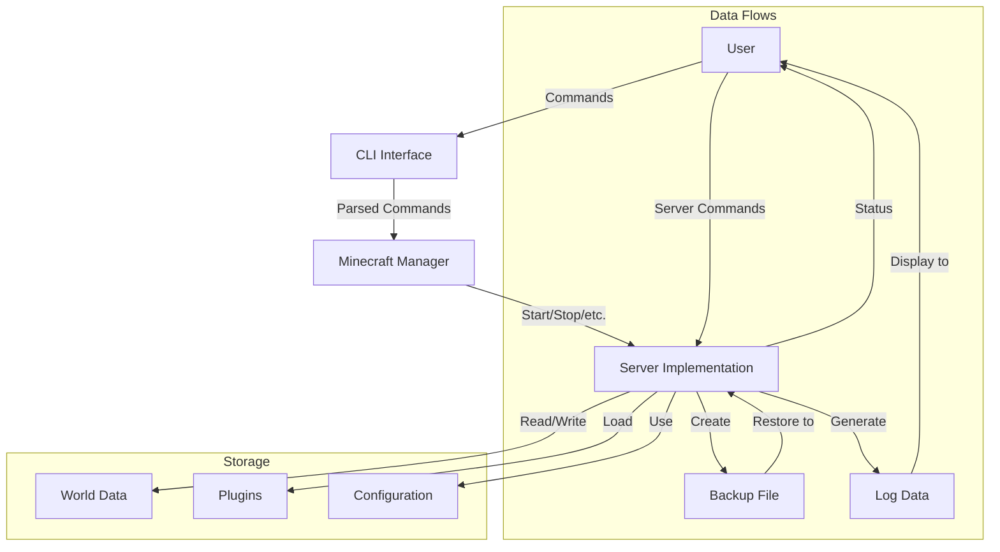
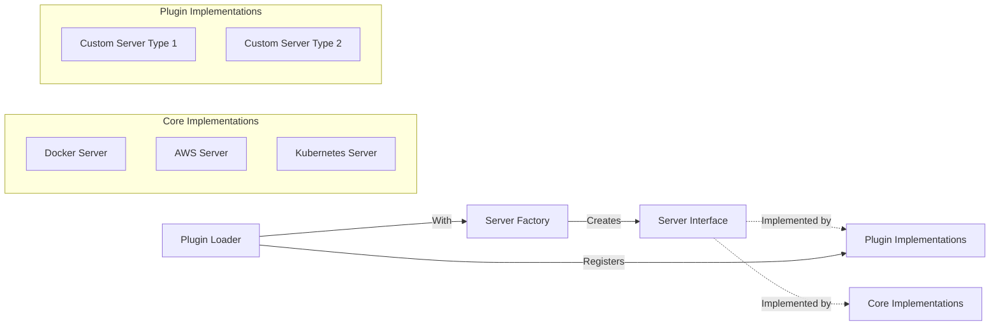
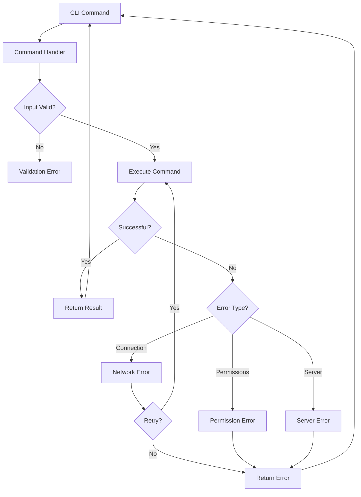

# Architecture Overview

The Minecraft Server Manager follows a Service-Oriented Architecture (SOA) with Domain-Driven Design (DDD) principles.

## Architectural Principles

- **Separation of Concerns**: Each component has a single responsibility
- **Interface-Based Design**: All implementations adhere to the same interface
- **Dependency Injection**: Dependencies are injected rather than created
- **Loose Coupling**: Components interact through well-defined interfaces
- **Open/Closed Principle**: Extensible without modifying existing code

## High-Level Architecture

## Component Diagram

## Sequence Diagram: Starting a Server

## AWS Deployment Architecture

## Data Flow Diagram

## Plugin Architecture for Extending Server Types

## Error Handling Flow

This architecture emphasizes:

1. **Modularity**: Each component has a single responsibility
2. **Extensibility**: New server types can be added without changing core code
3. **Testability**: Clean interfaces make testing straightforward
4. **Maintainability**: Small, focused files with clear domains

For implementation details, see the [API Reference](./api-reference.md).
