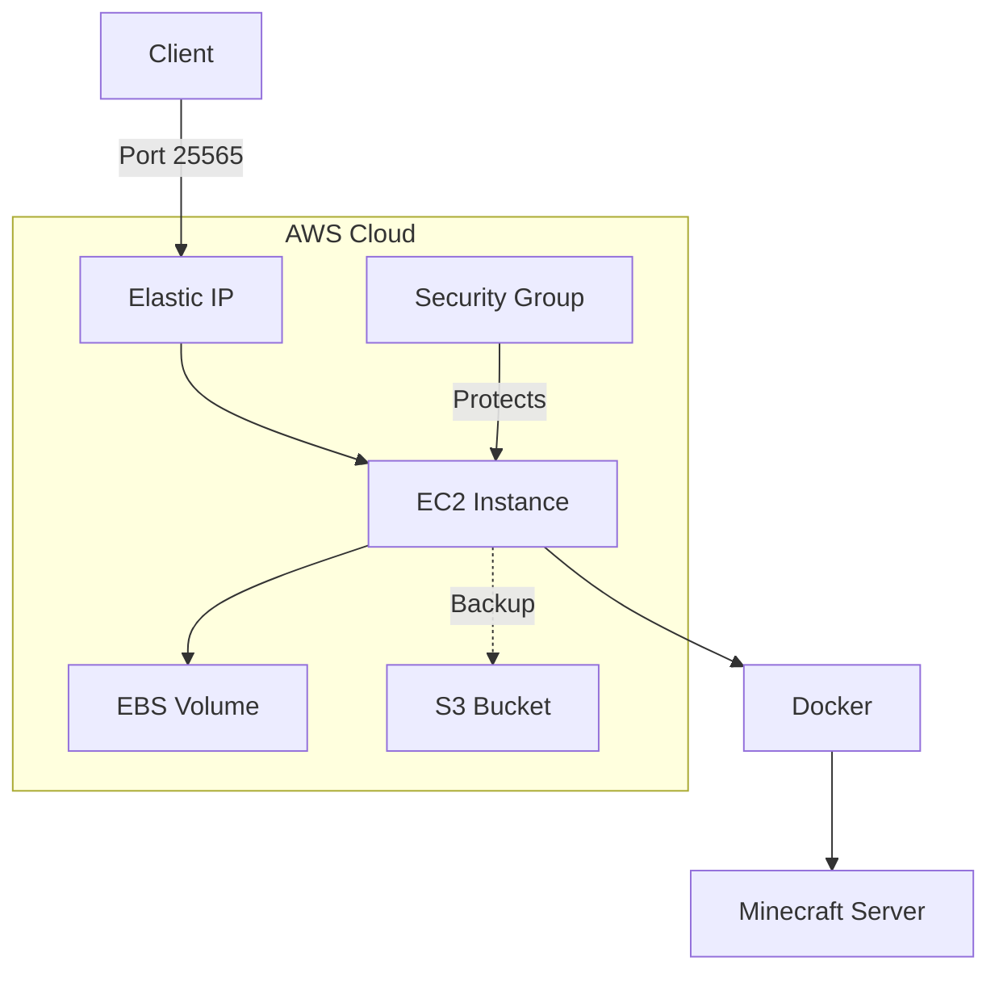

# AWS Deployment Guide

This guide explains how to deploy and manage a Minecraft server on AWS using the Minecraft Server Manager.

## Architecture

The AWS deployment uses the following AWS services:

- **EC2**: Virtual machine to run the Minecraft server
- **EBS**: Block storage for server data
- **S3**: Storage for backups (optional)
- **Security Groups**: Network security for the server
- **Elastic IP**: Static IP address for consistent access



## Prerequisites

1. AWS CLI installed and configured with appropriate credentials
2. SSH key pair for EC2 instance access
3. Python 3.6+ with required dependencies

## Deployment Options

### Quick Start

```bash
# Deploy with default settings
./minecraft-server.py --type aws \
    --region us-east-1 \
    --ssh-key ~/.ssh/id_rsa \
    --instance-id i-1234567890abcdef0 \
    start
```

### Using Terraform (Recommended)

The Terraform deployment provides a more reproducible and maintainable infrastructure setup.

1. Navigate to the terraform directory:

   ```bash
   cd terraform/aws
   ```

2. Initialize Terraform:

   ```bash
   terraform init
   ```

3. Customize the deployment by creating a `terraform.tfvars` file:

   ```
   region = "us-east-1"
   instance_type = "t3.medium"
   ssh_key_name = "my-key"
   ssh_public_key = "ssh-rsa AAAAB3Nz..."
   instance_name = "minecraft-server"
   minecraft_version = "1.20.1"
   minecraft_memory = "2G"
   ```

4. Plan and apply the Terraform configuration:

   ```bash
   terraform plan -out=tfplan
   terraform apply tfplan
   ```

5. After deployment, Terraform will output the server IP address and connection details.

### Advanced Configuration

#### EC2 Instance Configuration

The default instance type is `t3.medium`, which provides a good balance of CPU and memory for a small Minecraft server (5-10 players). For larger servers, consider:

| Instance Type | Players | Memory | vCPUs | Cost (approx.)\* |
| ------------- | ------- | ------ | ----- | ---------------- |
| t3.medium     | 5-10    | 4 GB   | 2     | $30-40/month     |
| t3.large      | 10-20   | 8 GB   | 2     | $60-75/month     |
| t3.xlarge     | 20-40   | 16 GB  | 4     | $120-150/month   |

\*Costs vary by region and usage.

#### Security Groups

The deployment creates a security group with the following rules:

- **Inbound**:

  - TCP port 22 (SSH): Restricted to your IP address
  - TCP port 25565 (Minecraft): Open to all
  - ICMP (ping): Open to all

- **Outbound**:
  - All traffic: Open to all

#### Data Persistence

Server data is stored on an EBS volume attached to the EC2 instance. The default size is 20 GB, which is sufficient for most servers. For larger worlds or modded servers, increase the volume size in the Terraform configuration.

## Server Management

Once deployed, you can manage the server using the following commands:

```bash
# Start the server
./minecraft-server.py --type aws --instance-id i-1234567890abcdef0 start

# Stop the server
./minecraft-server.py --type aws --instance-id i-1234567890abcdef0 stop

# Create a backup
./minecraft-server.py --type aws --instance-id i-1234567890abcdef0 backup

# Execute a command on the server
./minecraft-server.py --type aws --instance-id i-1234567890abcdef0 cmd "say Hello, world!"

# View server logs
./minecraft-server.py --type aws --instance-id i-1234567890abcdef0 logs --lines 100
```

## Automatic Backups

To set up automatic backups, you can use the AWS deployment with a cron job:

1. Create a backup script:

   ```bash
   #!/bin/bash
   /path/to/minecraft-server.py --type aws --instance-id i-1234567890abcdef0 backup
   ```

2. Make it executable:

   ```bash
   chmod +x backup-minecraft.sh
   ```

3. Add a cron job to run daily backups:

   ```bash
   crontab -e
   ```

4. Add the following line to the crontab:
   ```
   0 3 * * * /path/to/backup-minecraft.sh
   ```

This will run a backup every day at 3:00 AM.

## Cost Optimization

To optimize costs while running a Minecraft server on AWS:

1. **Use spot instances** for non-critical servers:

   - Modify the Terraform configuration to use spot instances
   - Set a maximum bid price to control costs

2. **Automate server shutdown** during inactive periods:

   - Create a schedule to stop the server during off-hours
   - Use AWS Lambda and CloudWatch Events to automate

3. **Use S3 Lifecycle rules** for backups:
   - Configure S3 Lifecycle rules to move older backups to cheaper storage classes
   - Automatically delete backups older than a certain age

## Troubleshooting

### Connection Issues

- **Cannot connect to server**:
  - Verify the security group allows traffic on port 25565
  - Check if the EC2 instance is running
  - Verify the Minecraft server is running on the instance

### SSH Issues

- **SSH connection refused**:
  - Verify the security group allows SSH (port 22)
  - Check if the EC2 instance is running
  - Verify your SSH key is correct

### Backup Issues

- **Backup fails**:
  - Check S3 bucket permissions
  - Verify the EC2 instance has sufficient disk space
  - Check if the server is running (may cause inconsistent backups)

## AWS Resources

The following resources are created by the Terraform configuration:

1. **VPC** with public subnet
2. **EC2 Instance** running the Minecraft server
3. **Security Group** with necessary rules
4. **EBS Volume** for server data
5. **Elastic IP** for consistent access
6. **S3 Bucket** for backups (optional)

## Terraform Structure

```
terraform/
├── aws/
│   ├── main.tf                  # Main configuration
│   ├── variables.tf             # Variable definitions
│   ├── outputs.tf               # Output definitions
│   ├── security.tf              # Security group configuration
│   ├── storage.tf               # EBS and S3 configuration
│   ├── network.tf               # VPC and subnet configuration
│   ├── compute.tf               # EC2 instance configuration
│   ├── modules/                 # Reusable modules
│   │   ├── minecraft-server/    # Minecraft server module
│   │   │   ├── main.tf
│   │   │   ├── variables.tf
│   │   │   ├── outputs.tf
│   │   │   └── templates/       # Templates for user data
│   ├── environments/            # Environment-specific configurations
│   │   ├── dev/
│   │   │   ├── main.tf
│   │   │   ├── terraform.tfvars
│   │   │   └── backend.tf
│   │   ├── prod/
│   │   │   ├── main.tf
│   │   │   ├── terraform.tfvars
│   │   │   └── backend.tf
```

## Best Practices

1. **Versioning**: Use a remote Terraform backend (e.g., S3) for state management
2. **Tagging**: Tag all resources for cost tracking and management
3. **Least Privilege**: Use IAM roles with minimal permissions
4. **Encryption**: Enable encryption for EBS volumes and S3 buckets
5. **Monitoring**: Set up CloudWatch alarms for server metrics
