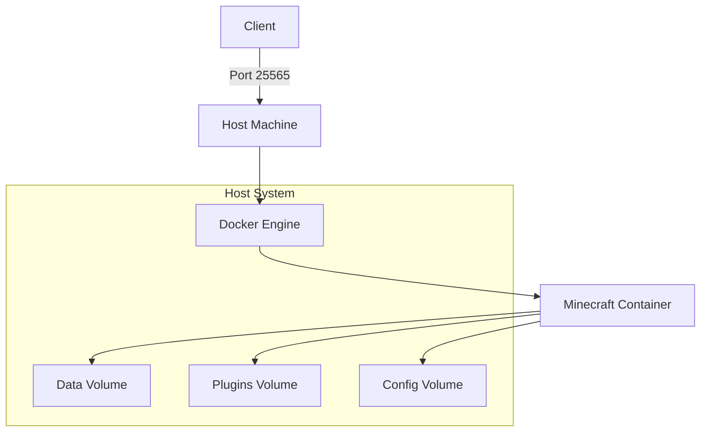

# Docker Deployment Guide

This guide explains how to deploy and manage a Minecraft server using Docker with the Minecraft Server Manager.

## Architecture

The Docker deployment runs the Minecraft server in a container on your local machine or server:



## Prerequisites

1. Docker and Docker Compose installed on your system
2. Python 3.8+ with required dependencies

## Quick Start

```bash
# Deploy with default settings (Paper server, latest version)
python minecraft-server.py start

# Deploy with specific version and server type
python minecraft-server.py --type docker --version 1.20.4 --flavor paper start

# Check server status
python minecraft-server.py status

# Stop the server
python minecraft-server.py stop
```

## Enhanced CLI Features

The Minecraft Server Manager now includes a beautiful command-line interface with progress bars, formatted tables, and colored output thanks to the Rich library.

### Available Commands

| Command   | Description                  | Example                                                 |
| --------- | ---------------------------- | ------------------------------------------------------- |
| `start`   | Start the Minecraft server   | `python minecraft-server.py start`                      |
| `stop`    | Stop the Minecraft server    | `python minecraft-server.py stop`                       |
| `restart` | Restart the Minecraft server | `python minecraft-server.py restart`                    |
| `status`  | Display server status        | `python minecraft-server.py status`                     |
| `backup`  | Create a server backup       | `python minecraft-server.py backup`                     |
| `restore` | Restore from a backup        | `python minecraft-server.py restore path/to/backup.zip` |
| `console` | Access server console        | `python minecraft-server.py console`                    |

### Command-Line Options

| Option                    | Description                                  | Default |
| ------------------------- | -------------------------------------------- | ------- |
| `--type`                  | Server deployment type (docker, aws)         | docker  |
| `--version`               | Minecraft version to use                     | latest  |
| `--flavor`                | Server flavor (paper, spigot, vanilla, etc.) | paper   |
| `--memory`                | Memory allocation for the server             | 2G      |
| `--disable-auto-shutdown` | Disable auto-shutdown for inactive servers   | False   |
| `--timeout`               | Auto-shutdown timeout in minutes             | 120     |
| `--debug`                 | Enable debug logging                         | False   |

## Docker Configuration

The Docker deployment uses the popular `itzg/minecraft-server` Docker image, which supports a wide range of configuration options.

### Directory Structure

When using the Docker deployment, the following directories are created:

```
.
├── data/      # World data and server configuration
├── plugins/   # Server plugins (if using a plugin-compatible server type)
├── config/    # Additional configuration files
└── backups/   # Backups of the server data
```

### Server Properties

Server properties can be customized through the environment variables in the Docker container. The Minecraft Server Manager handles the creation of the docker-compose configuration file, but you can also customize it directly.

Here are some common configuration options:

```yaml
version: "3"

services:
  minecraft:
    image: itzg/minecraft-server
    container_name: minecraft-server
    ports:
      - "25565:25565"
    environment:
      # Server type and version
      TYPE: "PAPER" # Options: VANILLA, SPIGOT, PAPER, FABRIC, FORGE
      VERSION: "1.20.4" # Minecraft version

      # Performance settings
      MEMORY: "2G" # Memory allocation
      USE_AIKAR_FLAGS: "true" # Optimized JVM flags

      # Game settings
      DIFFICULTY: "normal" # peaceful, easy, normal, hard
      MODE: "survival" # survival, creative, adventure, spectator
      MOTD: "Minecraft Server" # Server message

      # World settings
      GENERATE_STRUCTURES: "true"
      LEVEL_TYPE: "default" # default, flat, largebiomes, amplified
      SEED: "" # World generation seed

      # Player settings
      MAX_PLAYERS: "20"
      PVP: "true"
      ALLOW_FLIGHT: "false"

    volumes:
      - ./data:/data
      - ./plugins:/plugins
      - ./config:/config
    restart: unless-stopped
```

## Advanced Docker Deployment

### Custom Server Properties

To customize your server.properties with specific settings:

```bash
python minecraft-server.py start
# Wait for server to start and create server.properties
python minecraft-server.py stop
# Edit data/server.properties
python minecraft-server.py start
```

### Using the Server Console

You can access the server console to execute commands directly:

```bash
# Interactive console mode
python minecraft-server.py console

# Execute a single command
python minecraft-server.py console list
```

### Working with Backups

Create and manage backups easily:

```bash
# Create a backup
python minecraft-server.py backup

# Restore the latest backup
python minecraft-server.py restore

# Restore a specific backup
python minecraft-server.py restore /path/to/backup.zip
```

### Auto-Shutdown for Resource Saving

The auto-shutdown feature automatically stops the server when it's inactive for a specified period:

```bash
# Start server with auto-shutdown disabled
python minecraft-server.py --disable-auto-shutdown start

# Start server with custom timeout (30 minutes)
python minecraft-server.py --timeout 30 start
```

### Enabling Debug Mode

For troubleshooting and detailed logging information, use the debug flag:

```bash
# Start the server with debug logging enabled
python minecraft-server.py --debug start

# Check server status with verbose output
python minecraft-server.py --debug status
```

## Troubleshooting

### Common Issues

1. **Server won't start**:

   - Check Docker logs: `docker logs minecraft-server`
   - Ensure ports aren't already in use
   - Verify Docker is running properly
   - Run with `--debug` flag for detailed logs: `python minecraft-server.py --debug start`

2. **Can't connect to server**:

   - Verify the server is running: `python minecraft-server.py status`
   - Check firewall rules
   - Ensure port 25565 is open

3. **Performance issues**:

   - Increase memory allocation: `python minecraft-server.py --memory 4G start`
   - Enable Aikar's flags (done by default)
   - Consider switching to Paper server for better performance

4. **Container stops unexpectedly**:
   - Check Docker logs: `docker logs minecraft-server`
   - Examine the server logs in the data/logs directory
   - Increase allocated memory if out-of-memory errors occur
